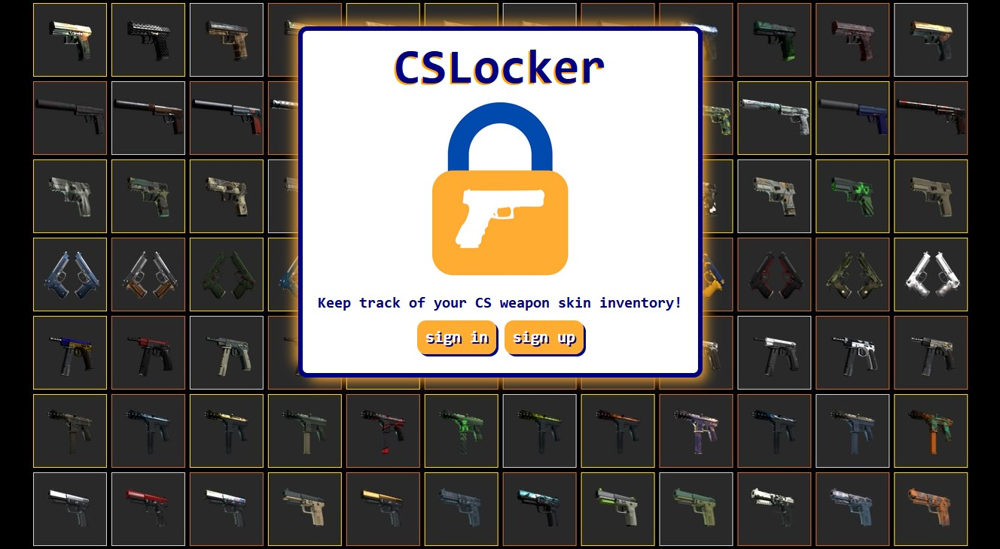
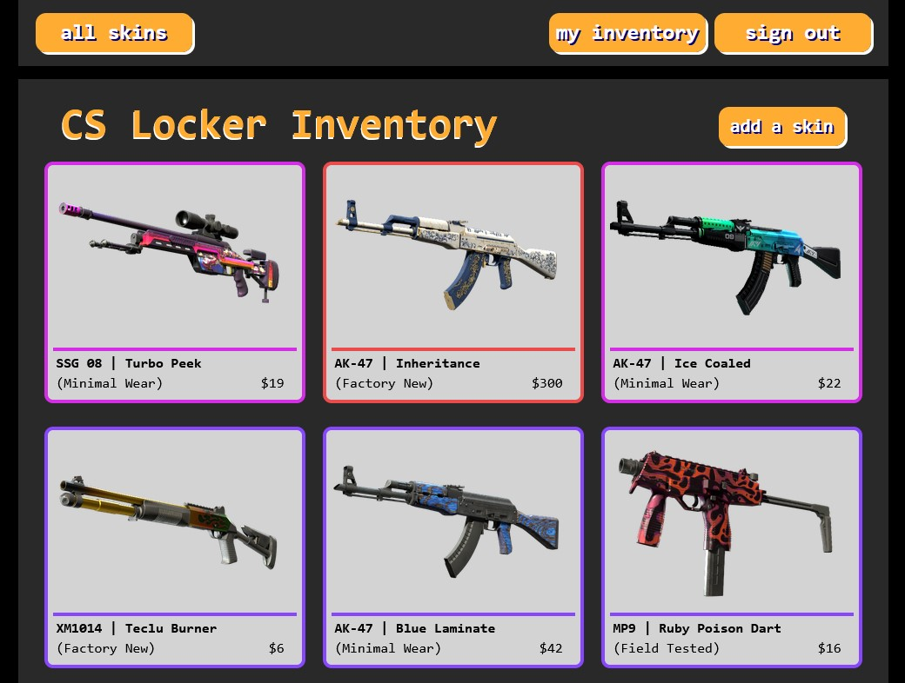
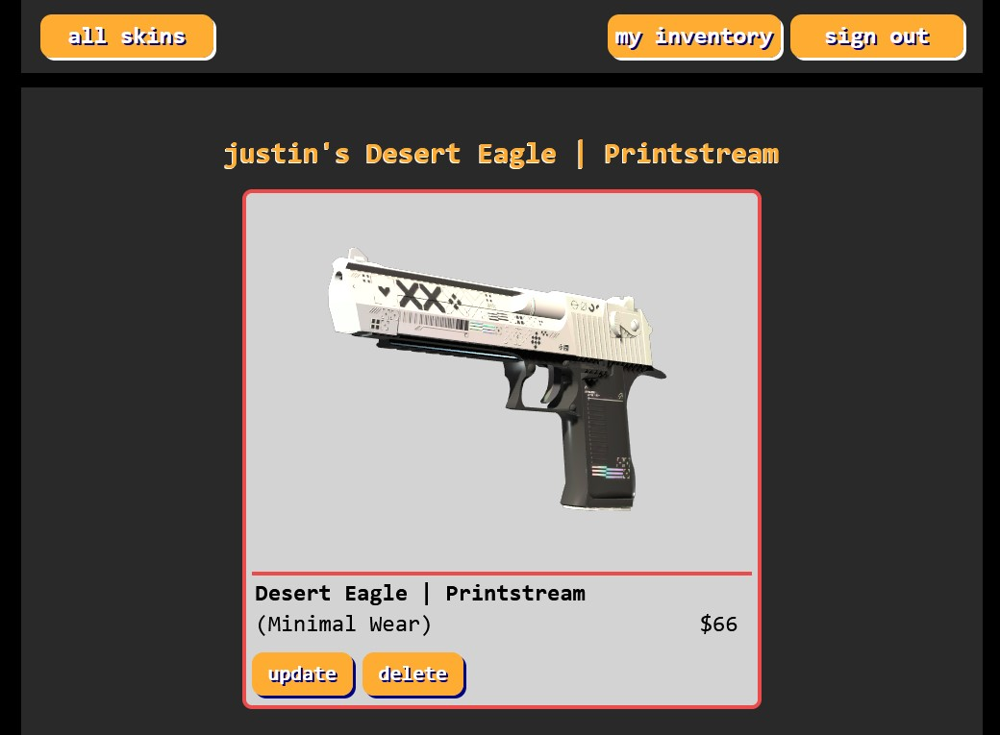
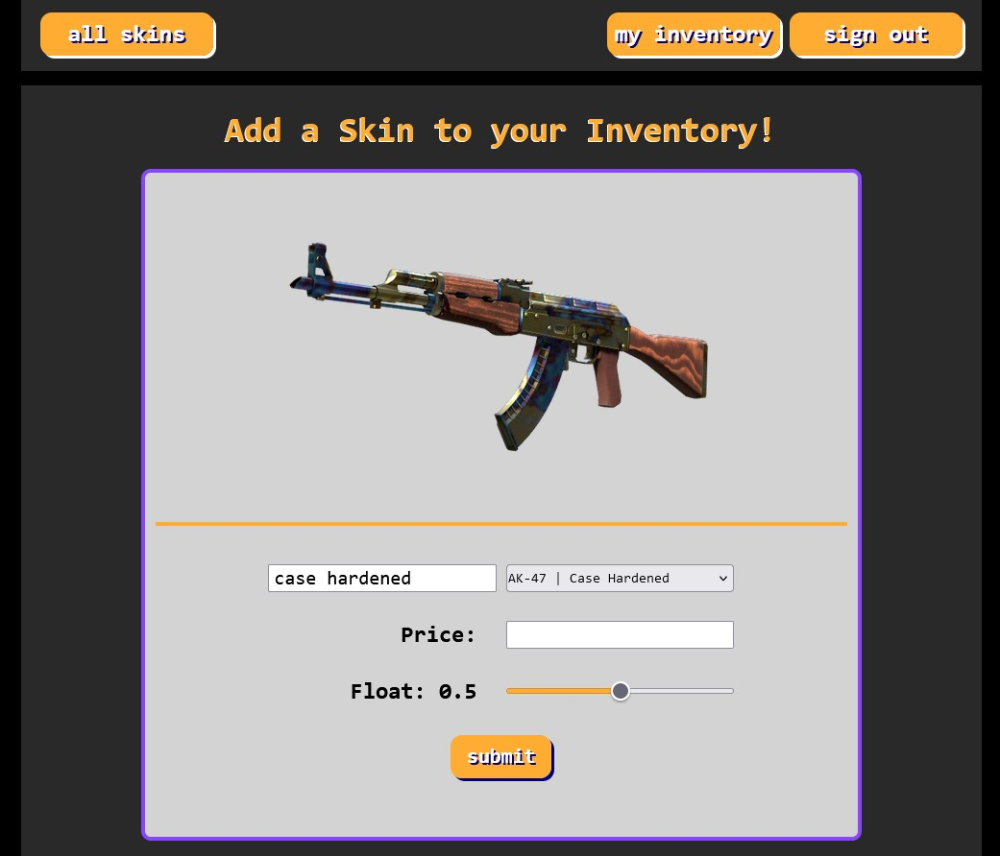

## CS Locker Inventory App - [View the app!](https://cs-locker-7353c5137766.herokuapp.com/)
 
>"Are we rushing in? Or are we going sneaky-beaky like?" - CT Side

## Description 🐱‍👤
CS Locker is a CRUD application that I made as a stripped down version of a Counter Strike skin trading site. 

Users are able to:
* create an account
* add skins to their account
* view skins added by other users
* edit the price of items in their inventory
* remove items from their inventory
* view user profiles

## Screenshots 🎥

#### Sign In / Sign Up Page

#### Landing Page / All Skins Added

#### Show Specific Weapon Page

#### Add New Weapon Page

## Technologies Used 🚀

## Future Improvements 🌃
- [ ] Refactor JS for readability and CSS for responsiveness
- [ ] Redesign buttons for navigating the pages with intuitiveness in mind
- [ ] Improve styling for forms 
- [ ] Add likes feature so users can interact with each other
- [ ] Add an inventory calculator so the user can see their total items owned
- [ ] Allow users to save sessions and auto sign in users on sign up
- [ ] Add users controller and add user account actions / customization
